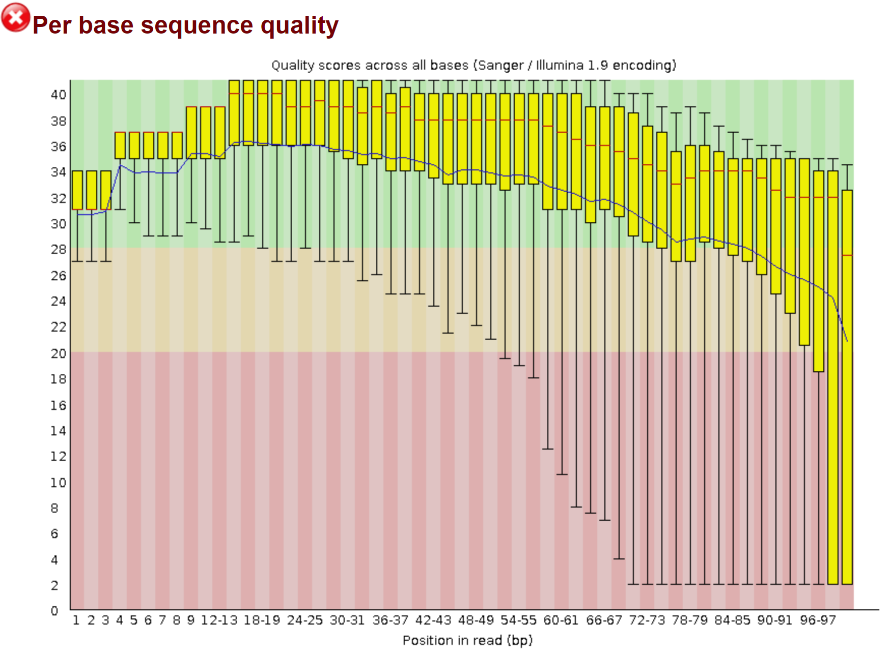
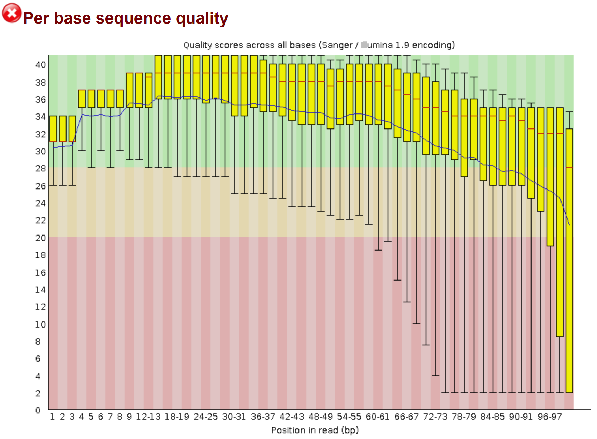
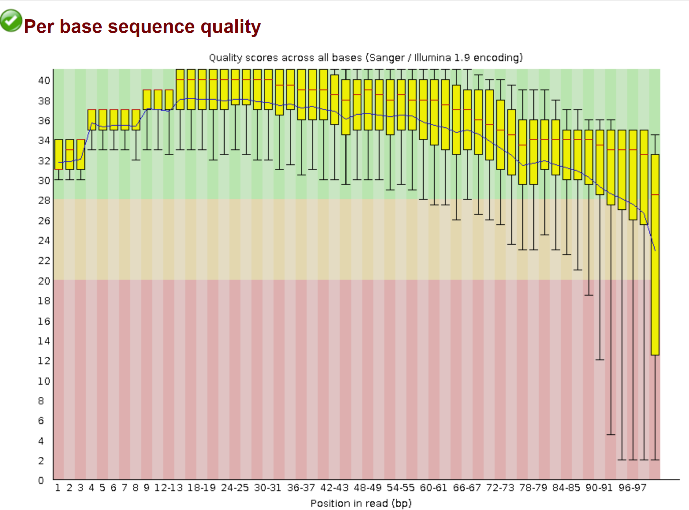
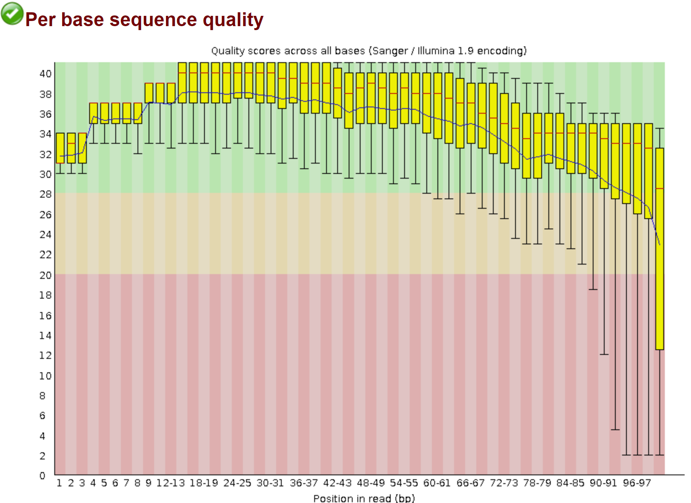
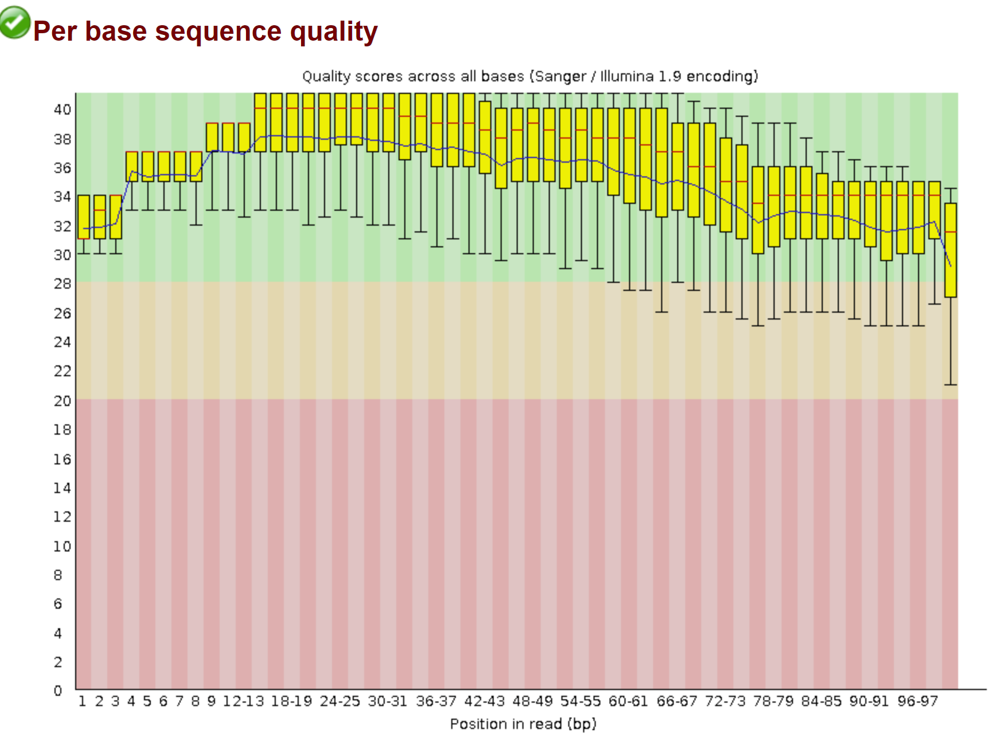
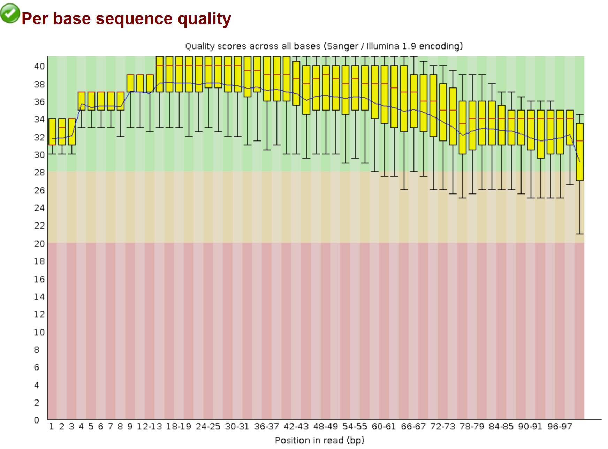

## Assignment 6 QC Report

### Introduction and Purpose
In genomic research, ensuring the quality of sequencing data is paramount for accurate downstream analyses such as variant calling, genome assembly, and transcriptome studies. Poor-quality reads can lead to erroneous conclusions, making quality control (QC) an essential step in the data processing pipeline. This assignment focuses on downloading sequencing data from the Sequence Read Archive (SRA), identifying a dataset with suboptimal quality, and performing a comprehensive QC analysis using tools like FastQC and fastp. The objective is to improve the quality of the reads and document the enhancements achieved through trimming and filtering processes.

### Dataset Selection
Organism: *Saccharomyces cerevisiae*

SRR Number: SRR800855

Date Published: 2013-04-02

Sample Description: Genome sequence of an isolate of brewer's yeast *Saccharomyces cerevisiae*

Publication Link: https://www.ncbi.nlm.nih.gov/pubmed/25840857

### Methodology
Tools used in this analysis:

FastQC: To assess the initial quality of raw reads and visualize quality metrics like per-base quality, GC content, and adapter contamination.

fastp: A tool chosen for its efficiency in performing quality trimming and removing low-quality bases and adapters.

MultiQC: Used to aggregate QC results from FastQC and summarize them in an easily interpretable report.


### Initial Quality Assessment for both Reads

Read 1


Read 2

```
Initial QC For both reads

Total Reads: 10,000
Total Bases: 1,010,000
Q20 Bases: 87.95%
Q30 Bases: 79.04%

Key Obervation

Both Read 1 and Read 2 displayed a significant drop in base quality toward the 3' end. Approximately 12% of the bases in both reads were below Q20, and nearly 21% were below Q30.
```

### Ater running fastp with default parameters
The initial filtering and trimming were performed using fastp with default parameters to improve the quality by removing low-quality bases and any adapter contamination.

Read 1


Read 2


```
Filtering Results for both reads

Total Reads Passed: 9,007 
Q20 Bases (Post-Trimming): 94.78% 
Q30 Bases (Post-Trimming): 85.93% 
Reads with adapter trimmed : 32

Key Observation

After trimming, the number of reads with high-quality scores (Q20 and Q30) increased significantly. The overall percentage of Q20 bases improved from 87.95% to 94.78%, and Q30 bases increased from 79.04% to 85.93%. Adapter contamination was minimal, with only 32 reads containing adapters, which were successfully trimmed.
```
### Perform fastp again (This time cut tail)
Given that the fastp report indicated no significant adapter contamination but some low-quality bases at the ends, a second round of trimming was performed using the --cut_tail option to remove these tails.

Read 1


Read 2

```
Filtering Results for both reads

Total Reads Passed: 9,007
Q20 Bases: 97.11% 
Q30 Bases: 88.08% 

Key Observation

The second round of trimming further improved the quality scores, increasing the Q20 and Q30 percentages to 97.11% and 88.08%, respectively. The duplication rate remained low, which is desirable, and no additional adapter trimming was necessary.
```

### Conclusion
The quality of the *Saccharomyces cerevisiae* reads improved significantly after trimming. I started with about 87% and 79% of the bases at Q20 and Q30 respectively, and after cleaning them up reached over 97% and 88% quality for Q20 and Q30 bases respectively for both reads.
