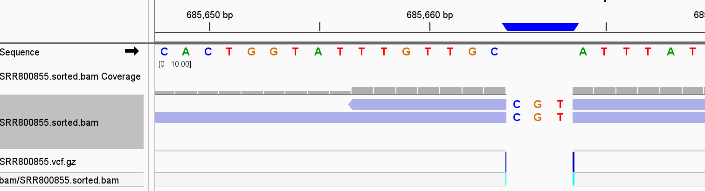
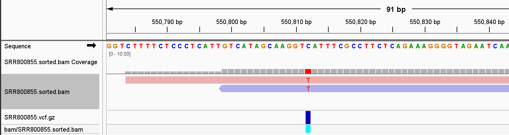
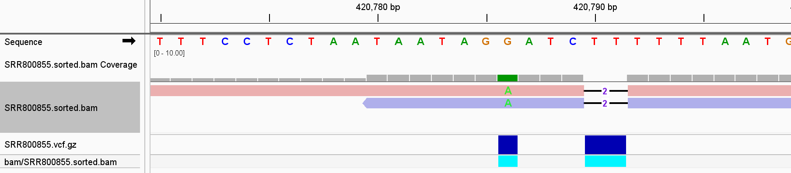
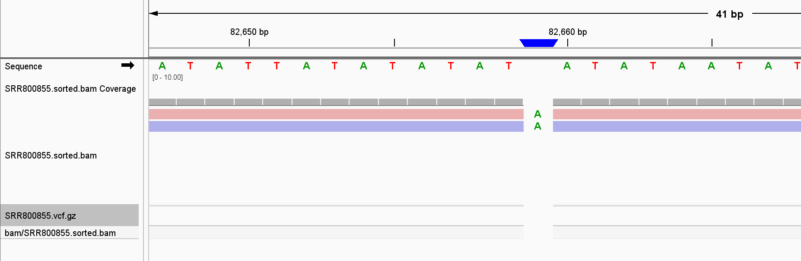
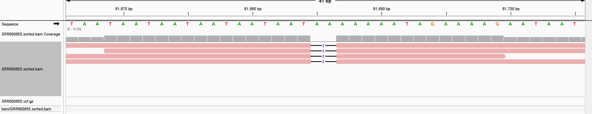
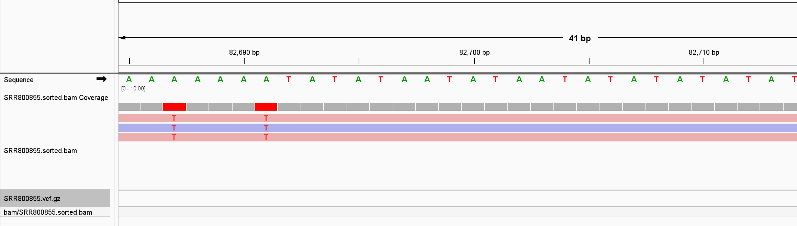

# Assignment 10

## Variant Calling Report

### Introduction
The objective of this assignment was to call variants on a BAM file generated from SRA reads using a Makefile. 
This report documents the variant calling process, discusses observed variants, and verifies the accuracy 
of the variant caller by manually reviewing the alignments.

### Methods
#### Makefile Process
Using a Makefile, I automated the steps to generate a BAM file from SRA reads and perform variant calling. Key steps included:

- Download SRA Reads: Retrieved raw data in FASTQ format.

- Alignment: Aligned reads to the reference genome using bwa mem, generating a sorted BAM file.

- Variant Calling: Called variants on the BAM file using bcftools call -mv to detect single nucleotide polymorphisms (SNPs) and insertions/deletions (indels).

#### Tools Used
- BWA for alignment.
- Samtools for sorting the BAM file.
- Bcftools for variant calling.

### Results

#### Variant Summary
The variant calling process resulted in various types of variants, including SNPs and indels.

Examples include the following:
- An insertion was found at position chrXII:685663, where there was just C on the Reference, however on the ALT, I observed a CCGT indicating an insertion.

- A SNP was found at position chrXV:550812, where a nucleotide change from C to T 

- A SNP and deletion found at position chrXIII:420786 and chrxIII:420790

#### Variant Caller Performance
#####  False Negatives

There were several regions with noticeable variants visible in the alignment file that were missed by bcftools. Some examples include the following:

- Position 82649 on chromosome M: A noticeable insertion in the alignment file was not detected by bcftools. See image below;

- Position 81680 on chromosome M: A visible deletion in the alignment file went undetected. See image below;

- Position 82690 on chromosome M: An A>T substitution was visible in the alignment file but missed by bcftools. See image below;

##### False Positives
No false positives were identified, though a more detailed analysis might reveal missed cases.
