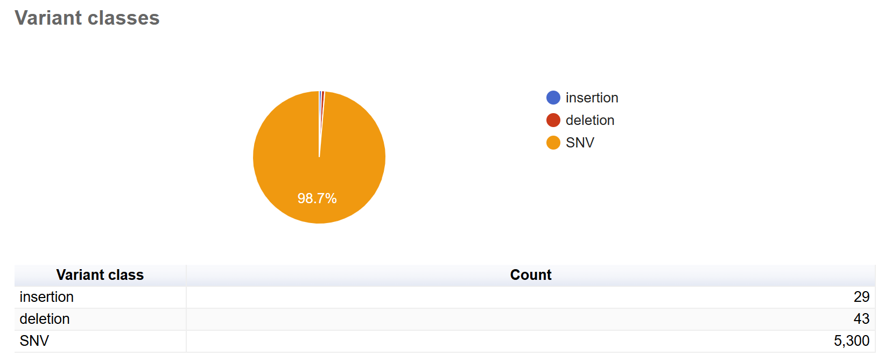
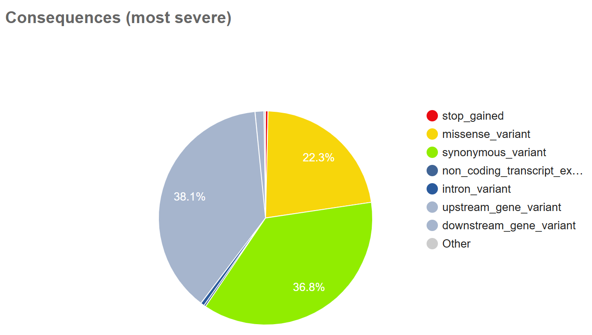
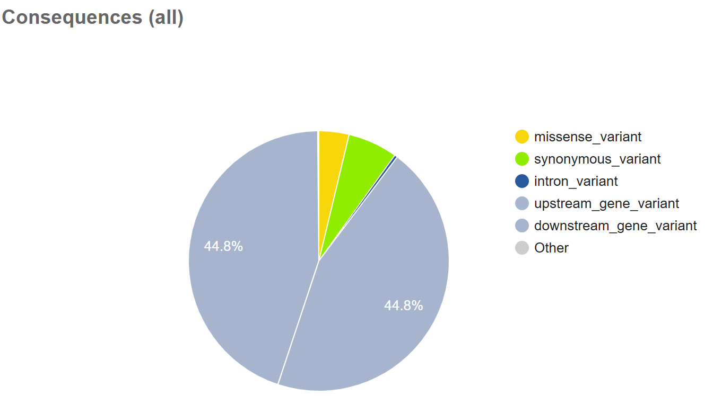
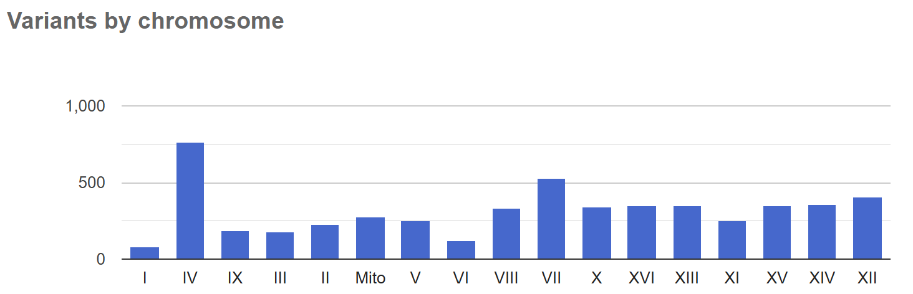

# Assignment 11

#  Variants Effect Prediction
### Objective

This Assignment aims to identify and evaluate the effects of variants in a VCF file derived from sequencing data. 
The workflow includes steps for genome preparation, read alignment, variant calling, and effect prediction using VEP (Variant Effect Predictor).

## Workflow

1. **Reference Genome Download**
   - Downloads the reference genome using `wget` 
   - Download the gff file uisng `wget`

2. **Read Download and Trimming**
     - Downloads sequencing reads from SRA using `fastq-dump`
     - Trims adapters and low-quality bases using `fastp`.
     - Further trims reads by removing low-quality tails.

3. **Quality Control**
     - Generates FastQC reports for raw, trimmed, and retrimmed reads using `fastqc`

4. **Genome Indexing**
     - Indexes the reference genome for alignment using `bwa index`

5. **Read Alignment,generate bam files and index**
     - Aligns the trimmed reads to the reference genome and generates sorted BAM files uisng `bwa mem` and `samtools`

6. **Variant Calling**
     - Calls genomic variants using `bcftools` and outputs a compressed VCF file.

> **NB:**  Before running VEP annotation, check out how to install VEP on the command line from here: https://www.biostarhandbook.com/appbio/methods/vep/

7. **Annotation**
     - Annotates variants with their effects using the Variant Effect Predictor (VEP).

> **Key Commands:**
> Tools used: `wget`, `fastp`, `fastqc`, `bwa`, `samtools`, `bcftools`, `VEP`.

## Results
**Variant Classes**

- Single Nucleotide Variants (SNVs): 5300

- Insertions: 29

- Deletions: 43

**Most Severe Consequences**

| Consequence Type             | Count   |
|------------------------------|---------|
| Stop Gained                  | 20      |
| Frameshift Variant           | 1       |
| Missense Variant             | 1197    |
| Synonymous Variant           | 1978    |
| Upstream Gene Variant        | 2047    |
| Downstream Gene Variant      | 72      |

**Variants by Chromosome**

- Chromosome IV: 765 variants (highest)

- Chromosome I: 84 variants (lowest)

- Mitochondrial DNA: 280 variants

