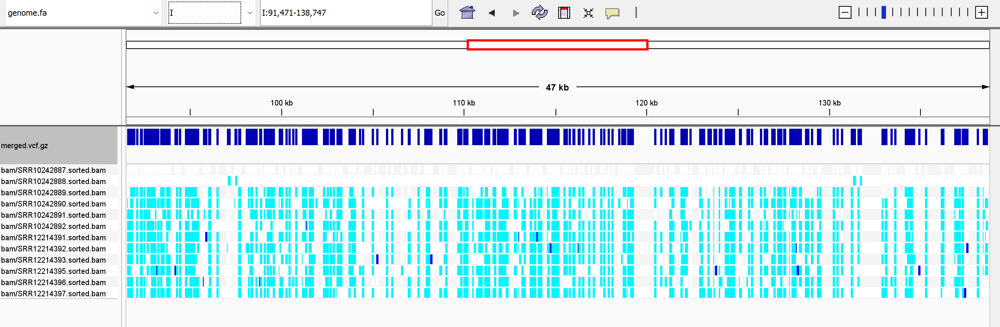

# Assignment 12
## Project number from SRA - PRJNA575820 

### Files 
- Makefile: Contains the commands to run the pipeline.

- design.csv: A CSV file listing sample information, including SRA accessions.


### Pipeline Workflow
The pipeline consists of the following steps:

**Step 1**
- Download Reference Genome: Downloads the genome from the specified URL, decompresses it.
- Index Reference Genome
Creates a BWA index for the reference genome.

**Step 2**
Sample Processing at the same time: To process 12 samples
```bash
cat design.csv | head -14 | parallel --lb -j -4 --colsep , --header : make all SRR={run_accession} SAMPLE={sample_alias}
```

The GNU parallel command above does the following:

- Download SRA Reads: Downloads raw sequencing reads for each sample listed in design.csv.
- Trim Reads: Processes raw reads using fastp for adapter trimming and quality filtering.
- Quality Control Reports: Generates FastQC reports for raw and trimmed reads.
- Align Reads: Aligns the trimmed reads to the reference genome and generates sorted BAM files.
- Variant Calling: Calls variants for each sample using bcftools.

**Step 3**
- Merge and index the vcf files : Merges individual VCF files into a single VCF file.


### Visualization of the Merged VCF files on IGV


### Key Observations
The merged VCF file represents variants detected across 12 samples.

**Variant Distribution**

- Certain regions show high-density variants (dark blue bars), suggesting shared genetic features or conserved loci.

**Sample Comparisons**
- Light blue blocks represent individual sample variants.
- Common variants are observed across multiple samples in high-density regions, suggesting shared genetic features.
- Unique variants in some samples could indicate population-specific or condition-specific mutations.