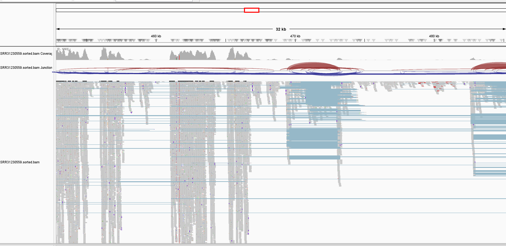
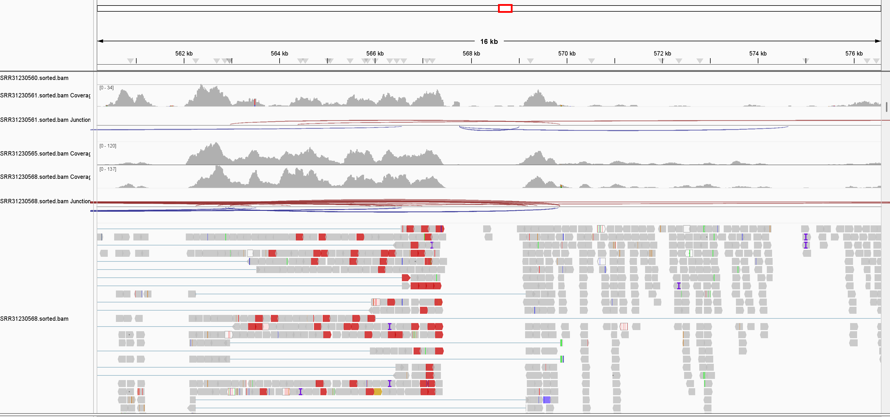
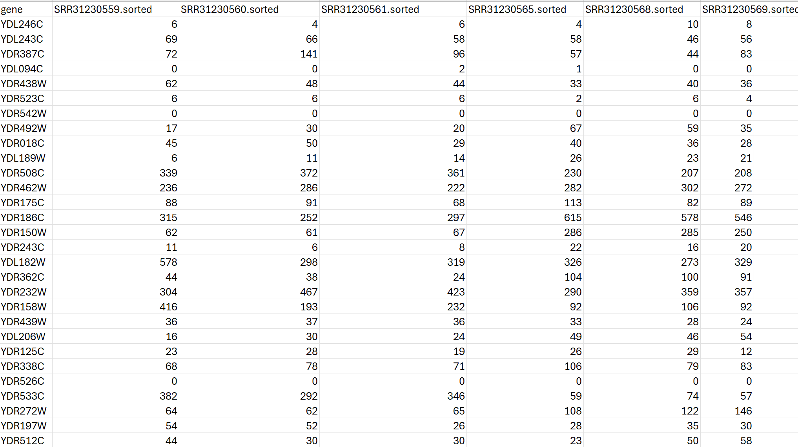

# Assignment 13

## Generate count matrix from RNA-seq data 

## Overview
This project implements an RNA-Seq analysis pipeline using a Makefile to automate the processing steps. The pipeline downloads reference genome and RNA-Seq data, processes and aligns the reads, and generates a count matrix summarizing gene expression for downstream analysis. 

#### Project Number used from SRA - PRJNA1185900.

## Pipeline Features
- Step 1: Reference Genome Download:

Downloads and indexes the reference genome using HISAT2.

Downloads the associated GTF file for annotation.

- Step 2: RNA-Seq Data Processing:

Downloads RNA-Seq reads from SRA.

Performs quality control, trimming, and retrimming.

- Step 3: Read Alignment:

Aligns reads to the reference genome using HISAT2.

Sorts and indexes BAM files using samtools.

- Steps 4 and 5: Gene Count Matrix:

Generates a count matrix with featureCounts.

Formats the matrix into a CSV for further analysis.

## Files in Submission
**Makefile**: Automates the RNA-Seq analysis pipeline.

**design.csv**: Defines the sample names and run accessions.

**README.md**: Instructions and details about the pipeline.

## Pipeline Steps
1. Setup
Install required tools:
```wget```, ```hisat2```, ```fastp```, ```fastqc```, ```samtools```, ```featureCounts```.
micromamba and R packages for count matrix formatting.

2. Run the Pipeline
Execute the following commands to run the pipeline:

```bash
make Ref_genome
make gtf
```

Process All Samples: Processes reads for all samples listed in design.csv.
```bash
make process_all
```
Align Reads: Aligns retrimmed reads to the reference genome.
```bash
make align_sra
```
Generate Count Matrix: Summarizes gene expression levels
```bash
make countmatrix
```

>>> To be able run the last step, you need have a conda environment called stats and an Rscript which contains code to format the count matrix. The guidelines can be obtained from the Biostar Handbook. 

Format Count Matrix: Converts the matrix into a CSV format.
```bash
make final_countmatrix
```


## Visualization with IGV




## Count Matrix Analysis


**Treated Samples** - (first 3 samples: SRR31230559, SRR31230560, SRR31230561) 

**Untreated Samples** -(last 3 samples: SRR31230565, SRR31230568, SRR31230569) samples. Here are a few key points:

### Observations
- **General Trends**:
Some genes (e.g., YDR186C, YDL182W) show consistently higher counts across both treated and untreated samples, indicating higher expression levels.

Other genes (e.g., YDR542W, YDR526C) show almost no counts in either condition, suggesting these genes may not be actively expressed under these conditions.

- **Treated vs. Untreated Differences**:

Certain genes (e.g., YDL243C, YDL182W) show notable differences in expression between the treated and untreated samples. For example:

YDL182W is expressed more in treated samples (e.g., 578, 298, 326) compared to untreated samples (319, 273, 329).

YDL243C shows a drop in untreated samples compared to treated samples.