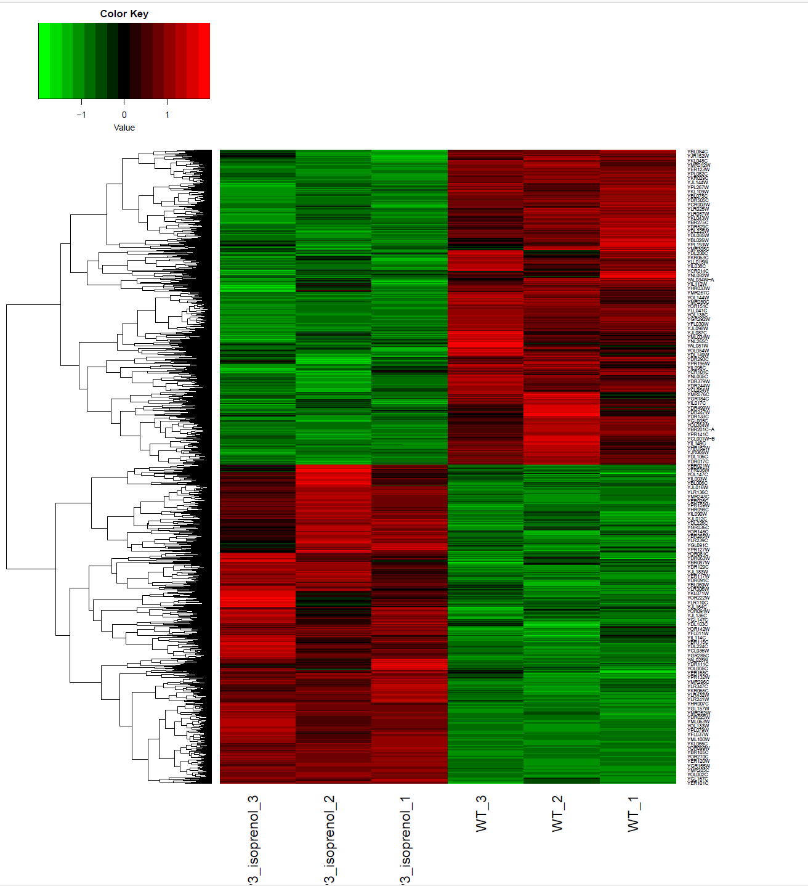
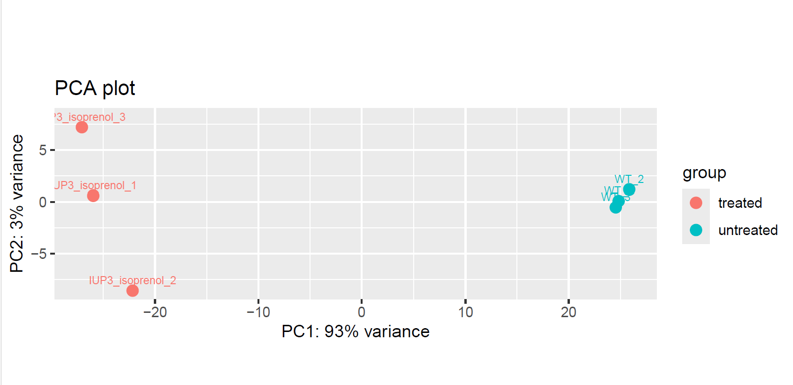
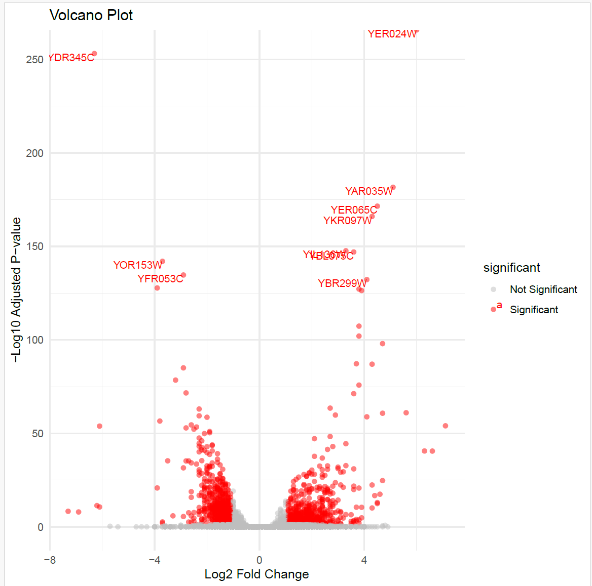

# Assignment 14

## Differential Gene Expression Analysis
NB// This is a continuation from Assignment 13 so here I focused on the new targets added to the makefile and discuss some results generated.

## Overview
This project performs a differential expression analysis of a count matrix to identify genes or transcripts that are differentially expressed between treated and untreated samples. The analysis includes visualization of results through PCA plots, heatmaps, and a volcano plot.

### New targets added to the makefile
>>> NB//: To be able to run these targets you need to get access to the bioinformatic tools from the Biostar handbook, follow the tutorials and download into your project directory. However to generate the volcano plot, you can create your own R script/ or use what is in the Week14 directory with filename plot_volcano.
```bash
make deseq2
```
```bash
make plots
```

## Results

### Differential Gene Expression

- Input: 7127 rows
- Removed: 1127 rows
- Fitted: 6000 rows
- Significant PVal: 3286 ( 54.8 %)
- Significant FDRs: 3013 ( 50.2 %)

### Heatmap
-  Heatmap displays hierarchical clustering of DEGs.
- Significant genes clustered samples into treated and untreated groups.
- The color gradient highlights the relative upregulated and downregulated genes.
- Each column represent a sample
- Each row represent a gene




### PCA plot
- PCA plots were generated to observe sample variability.
- PC1 explained 93% of the variance, while PC2 explained 3%
- Clear separation between treated and untreated samples was observed.
- Individual variability within groups was minimal, indicating consistent replicates.



### Volcano plot
- Volcano plot visualizes log fold change against significance levels.
- Top 10 Significant genes are highlighted with absolute log2 fold change greater than 1 with adjusted p-value less than 0.05.




### Discussion
Treated samples showed distinct gene expression profiles.

The reliability of data appears strong, supported by clear separation in PCA and clustering in the heatmap.