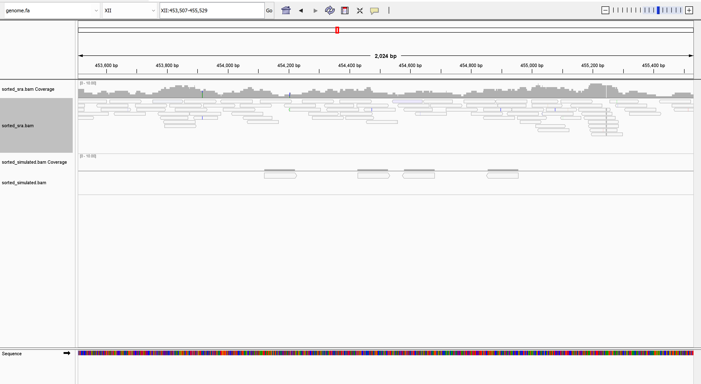

## Assignment 8 - This is a continuation of Assignment 7

## New things added
- Index for the reference genome

- Alignment of the simulated reads and the reads downloaded from SRR to the reference genome

- Comparing the alignment from both reads


### Statistics for similated reads
```
19998 + 0 in total (QC-passed reads + QC-failed reads)
19998 + 0 primary
0 + 0 secondary
0 + 0 supplementary
0 + 0 duplicates
0 + 0 primary duplicates
19998 + 0 mapped (100.00% : N/A)
19998 + 0 primary mapped (100.00% : N/A)
19998 + 0 paired in sequencing
9999 + 0 read1
9999 + 0 read2
19998 + 0 properly paired (100.00% : N/A)
19998 + 0 with itself and mate mapped
0 + 0 singletons (0.00% : N/A)
0 + 0 with mate mapped to a different chr
0 + 0 with mate mapped to a different chr (mapQ>=5)
```

### Statistics for SRR
```
17352 + 0 in total (QC-passed reads + QC-failed reads)
17304 + 0 primary
0 + 0 secondary
48 + 0 supplementary
0 + 0 duplicates
0 + 0 primary duplicates
16794 + 0 mapped (96.78% : N/A)
16746 + 0 primary mapped (96.78% : N/A)
17304 + 0 paired in sequencing
8652 + 0 read1
8652 + 0 read2
16386 + 0 properly paired (94.69% : N/A)
16714 + 0 with itself and mate mapped
32 + 0 singletons (0.18% : N/A)
248 + 0 with mate mapped to a different chr
200 + 0 with mate mapped to a different chr (mapQ>=5)
```

### Differences between the two dataset
The simulated dataset has perfect alignment with 100% of reads mapped, 100% properly paired, and no errors or supplementary alignments. In contrast, the SRA dataset shows a 96.78% mapping rate, 94.69% properly paired reads, 0.18% singletons, and 48 supplementary alignments, reflecting real-world sequencing variability. Additionally, 1.43% of SRA reads have mates mapped to different chromosomes, which is not observed in the simulated data.


### Snap shot for visualizing part of the bam files


